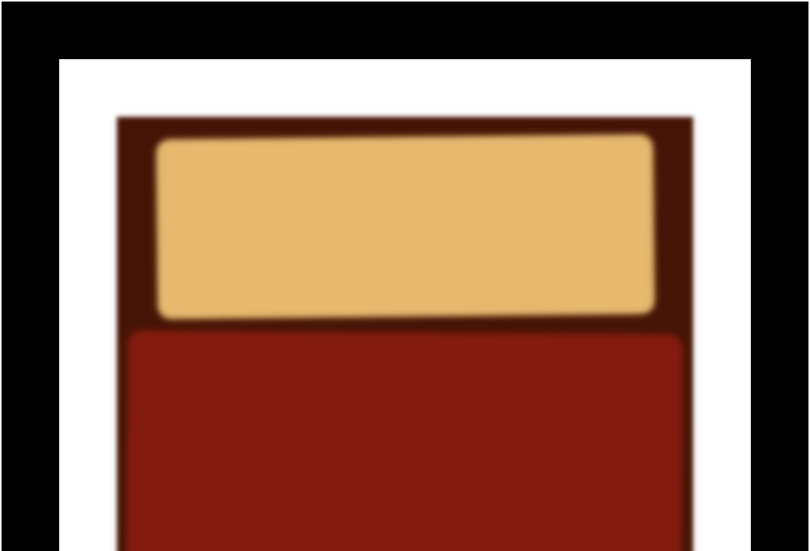

# rothko-painting

A very simple webpage that presents a design for a rothko painting.

**Live Demo:** [https://oendemann.github.io/rothko-painting/]

---

---

## About The Webpage

A guided project from the web design course on freeCodeCamp.

---

## Built With

* **HTML:** Used for the structure and format of the "painting" (separated the webpage into the different rectangles that made-up the painting).
* **CSS:** Used to create all details attributed to the painting (e.g. blur, color, margin, etc).

---

## What I Learned

1. I gained a better understanding of what the margin and padding syntax actually meant for a variable.
2. A reminder of common CSS shortands (e.g. margin and padding shorthands).

---

## Acknowledgments

* Project idea and requirements from [freeCodeCamp.org]
(https://www.freecodecamp.org/)